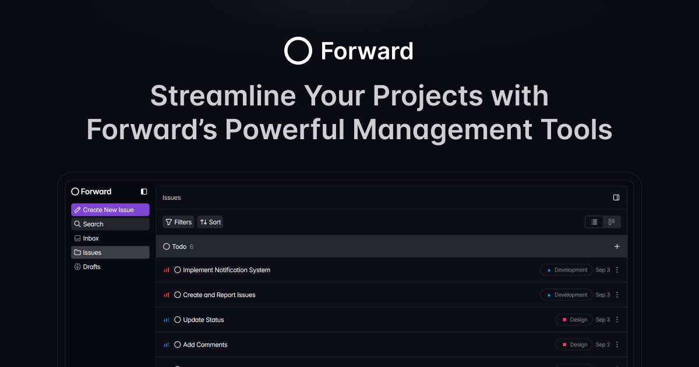

#  Forward

A web-based SaaS for Issue Tracking & Project Management

### Link for [Live Demo](https://forward-demo-app.netlify.app/)



## Table of Contents

- [Features](#features)
- [Tech Stack](#tech-stack)
- [Setup and Installation Instructions](#setup-and-installation-instructions)
- [License](#license)

## Features

### Creating New Issue

https://github.com/user-attachments/assets/56510285-ca57-4b9f-8bc2-3d41cffe97c6

### Issue Properties

https://github.com/user-attachments/assets/789ad99e-f575-43e0-a653-f51cb1e2599f

### List view and Kanban board

https://github.com/user-attachments/assets/63420e5a-0f5c-479e-ad32-918b32088b90

### Filtering and Sorting

https://github.com/user-attachments/assets/9f9cb5a7-00fb-47a7-88b9-f6ee85831713

### Creating New Draft

https://github.com/user-attachments/assets/65093d72-8d07-41e9-95d6-407a968ce0ea

### Draft Properties

https://github.com/user-attachments/assets/1b89e58d-d118-4064-9b2c-376b142a2397

### Customizing Preferences

https://github.com/user-attachments/assets/560a9447-70d3-4921-9b00-347806a47ee0

## Tech Stack

This project is built with the following technologies:

- **Framework:** React
- **Language:** TypeScript
- **Build Tool:** Vite
- **Styling:** Tailwind CSS

## Setup and Installation Instructions

Follow these steps to get the project running locally:

1. Clone the repository:
   ```bash
   git clone https://github.com/rveljko/forward.git
   ```
1. Navigate into the project directory:
   ```bash
   cd forward
   ```
1. Navigate to the dashboard folder:
   ```bash
   cd dashboard
   ```
1. Install dependencies:
   ```bash
   npm install
   ```
1. Configure environment variable:
   - Create a `.env` file with the following variables (you can create a free PostHog account and get your key and host at [PostHog Signup](https://us.posthog.com/signup)):
     ```
     VITE_PUBLIC_POSTHOG_KEY=
     VITE_PUBLIC_POSTHOG_HOST=
     ```
1. Start the development server:
   ```bash
   npm run dev
   ```
1. Open your browser and navigate to:
   ```
   http://localhost:5173
   ```

## License

This project is licensed under the [Apache License 2.0](LICENSE). See the LICENSE file for more details.
