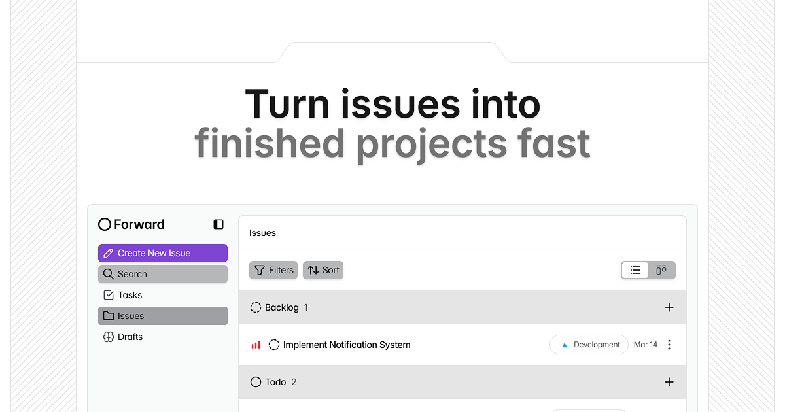

#  Forward

A web-based SaaS landing page for Issue Tracking & Project Management

### Link for [Live Demo](https://forward-demo-app.netlify.app/)



## Table of Contents

- [Tech Stack](#tech-stack)
- [Setup and Installation Instructions](#setup-and-installation-instructions)
- [License](#license)

## Tech Stack

This project is built with the following technologies:

- **Framework:** Next.js
- **Language:** TypeScript
- **Styling:** Tailwind CSS

## Setup and Installation Instructions

Follow these steps to get the project running locally:

1. Clone the repository:
   ```bash
   git clone https://github.com/rveljko/forward.git
   ```
1. Navigate into the project directory:
   ```bash
   cd forward
   ```
1. Navigate to the dashboard folder:
   ```bash
   cd website
   ```
1. Install dependencies:

   ```bash
   npm install
   ```

1. Start the development server:
   ```bash
   npm run dev
   ```
1. Open your browser and navigate to:
   ```
   http://localhost:3000
   ```

## License

This project is licensed under the [Apache License 2.0](/LICENSE). See the LICENSE file for more details.
